# Try Hack Me - Pickle Rick

Today we are going to be attempting to complet the Pickel Rick from from Try Hack Me!  
https://tryhackme.com/room/picklerick  

## Disclaimer -  My IP address will be different from yours!

---

## Scanning & Enumeration

A good rule of thumb is to start by scanning your machine for any open ports.  
Command: `nmap -T4 -sC -sV -A -p- 10.10.82.95`  
Command Breakdown:

	-T4: speed of nmap scan is 4/5 (personal preference of mine)

    -sC: Scan with default NSE scripts. Considered useful for discovery and safe

	-sV: Attempts to determine the version of the service running on port

    -A: do an extensive scan on these ports

	-p-: Scann all ports

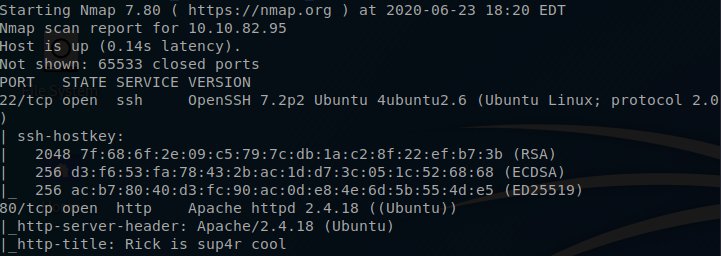  

---
## Enumerating Services

Port 22- ssh

Here we are able to see that our SSH port is open. This port isn't too vulnerable unless we have found someones credentials. Se we will not mess with it.

Port 80- http

It is here were we find a webservice. Lets poke around and see if there is anyting interesting.  

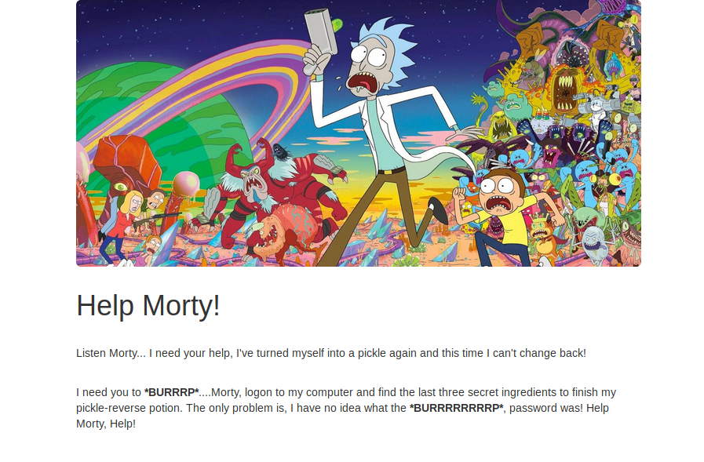

It looks as if we have a web page. It also seems that Rick really does need our help.  
Checking out the source code of a page can reveal all sorts of things.
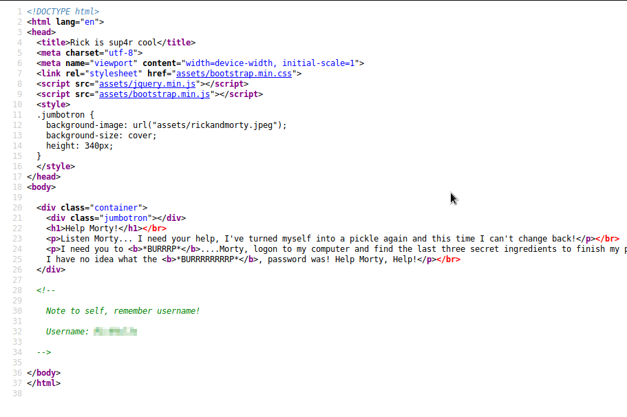  
Great it looks like we have found a user name. Lets take note of that and keep digging, maybe we will get lucky and find the password.  

---
## Finding hidden directories

We are going to be using gobuster to try and locate any directories that may have been hidden from us.  
Command: `gobuster -u http://10.10.82.95 -w /usr/share/dirbuster/wordlists/directory-list-2.3-medium.txt -x php,sh, txt,cgi,html,css,js,py`  

Command Breakdown:

    -u: Full URL (including scheme), or base domain name.

	-w: Path to the wordlist used for brute forcing (use – for stdin).

    -x: List of extensions to check for, if any.  

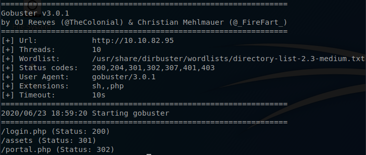  

It looks like GoBuster was able to find a few directories for us.  
How about we go and check out the login.php.
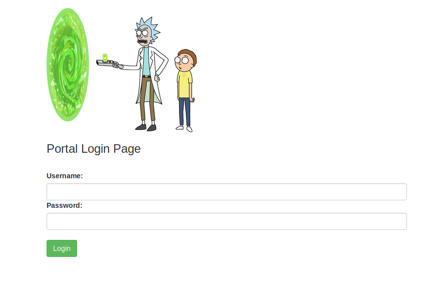 

Eariler we found a username but at this moment we still do not have a password.  
Most websites will have a robots.txt file that will tell a browser what is and isn't allowed to index. So lets see if there is one for this site.  
Success! It seems that there is a robots.txt for this site and in that file is a very obvious reference to the show Rick and Morty! Lets try this and see if it our password. 
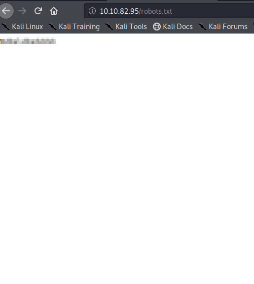  
YES! We where able to get loged in and we where brought to the command portal.
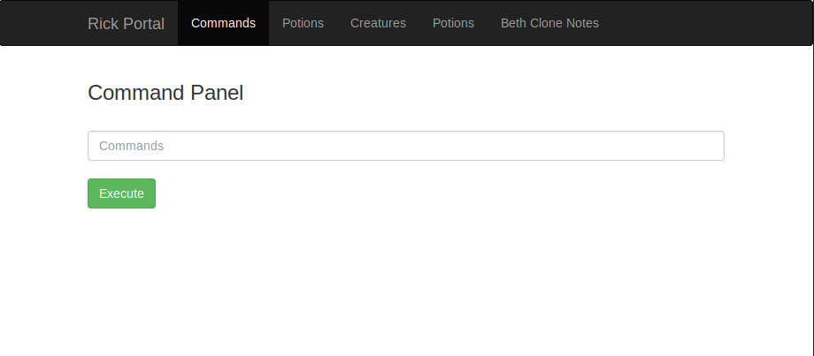 
Now since this page is called the command portal lets try and actually enter in some command and see what happens.  
If we enter in the ls command we can see that some results are being returned. It would seem that we have also found our first ingredient.
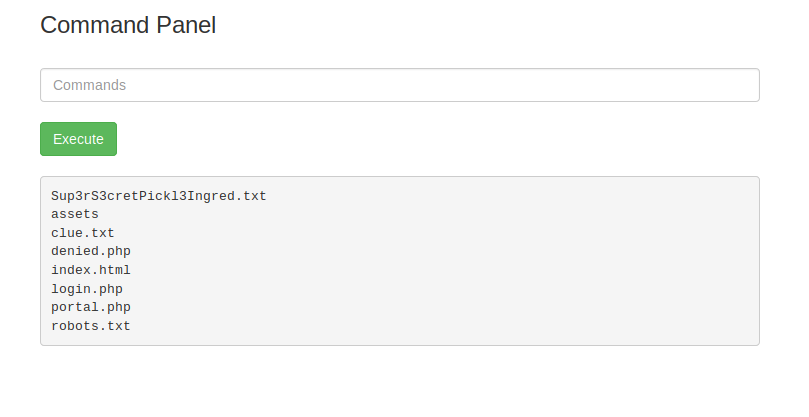 
I wonder if we can access the Sup3rS3cretPickl3Ingred.txt the same way we did our robots.txt file. So in my browser I just went to the following page `http://<ipAddress>/Sup3rS3cretPickl3Ingred.txt` and what do you know we now have the content of that text file. One down two to go!  
 

---

## Digging deeper

We are now one ingredient. It is time to find the other two but where do we start looking.  
Lets go back to our command portal and us the ls command again. We see that there is a file call clue.txt, how about we open it up and see if there is anything useful in it.  
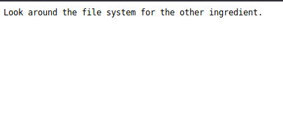  
Maybe it is just me but the words file system seem to jump out at me. So lets go to the command portal and use `ls /home`.  
This will list out everyting in our home directory.. and would you lookie there is a dictory called rick. Lets keep digging and use `ls /home/rick` and within the rick dicectory we have a file called `second ingredients`.  
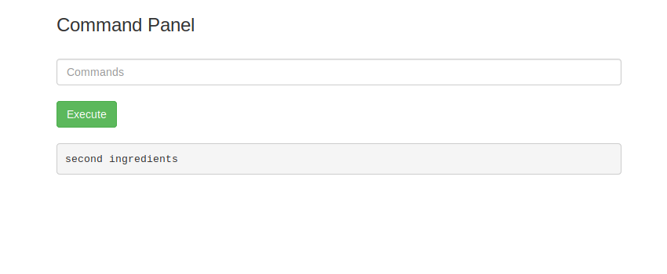  
I wonder if it is posible for us to use the `cat` command to receive the content of the second ingredient. Well lets try.  
It looks like we are getting an error telling us that the command we used has been disabled.  
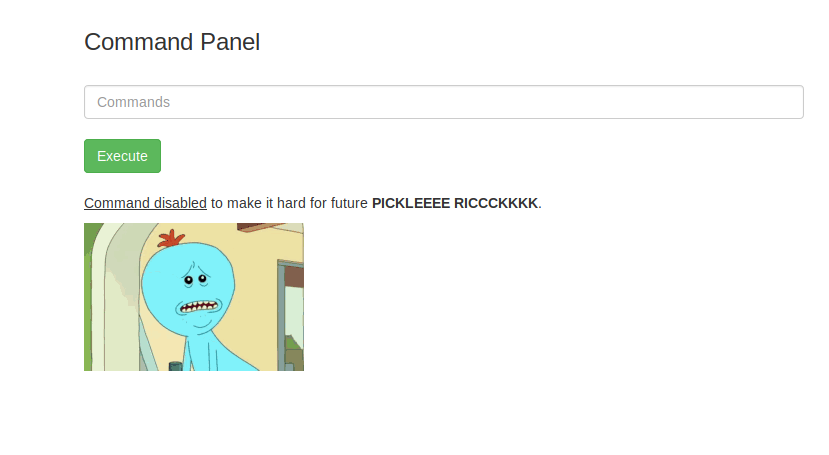  

---
## Research

I tried every command that I could think of and each of them always got me right back to the same command disabled page. So I had to reach out to my dear old friend agent Google to try and find out if there was an alternative command to cat.
It toke sometime but I was able to find a nice [wikipedia](https://en.wikipedia.org/wiki/Less_(Unix)) artical on the `less` command.  
Now we pull the trigger and see if this command will work for us.  
Command: `less '/home/rick/second ingredients'`  
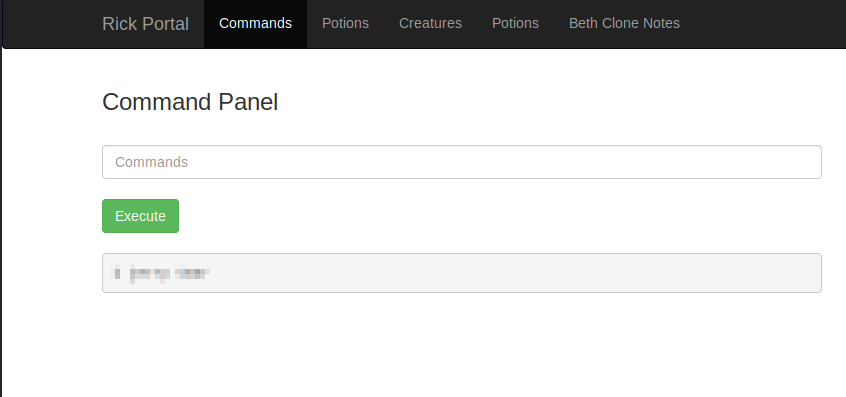 
Well HOT HAM! That acutlly worked and we now have the second ingredient.  
Now that we know the `less` command will work for us we just need to track down the thrid and final ingredient.  
Lets see if we are able to use `ls` and get into the `/root` directory. It seems that we are not able to view anything in from the `/root`.. I wonder if if we are able to use `sudo` to elevated our user prevlages.  
Command: `sudo -l`  
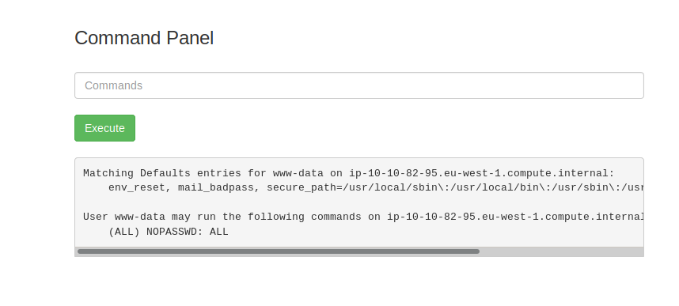  
WHAT!!! We are able to combine sudo with any command and not get prompted for a password. This may be just what we need in order to see what is in the `/root` directory. We will just need to combine sudo and ls to see what all is in that directory.  
Command: `sudo ls /root`
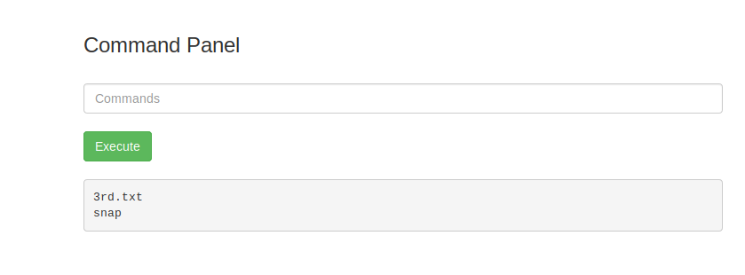 
Now that we have found the location of the third ingredient we are going to use our dear friend `less` to receive the contents of it, but remember since we are in the root directory we will need to add `sudo` to the front of our command.    
Command: `sudo less /root/3rd.txt`  
  

# Congratulations you have just completed the Pickel Rick challenge!